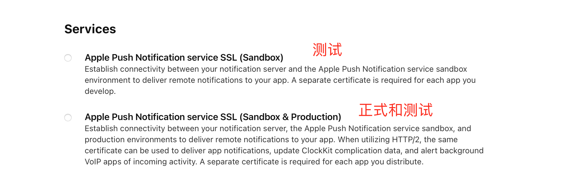
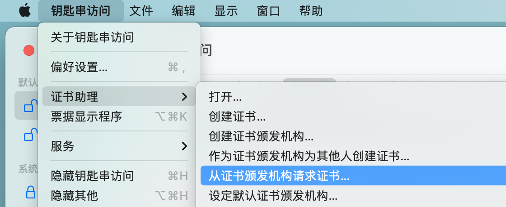
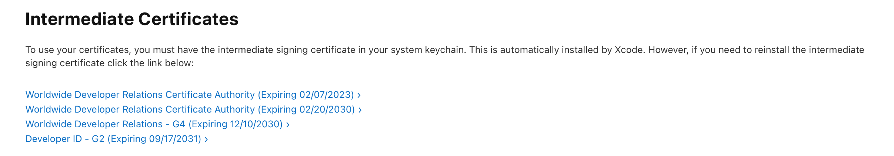
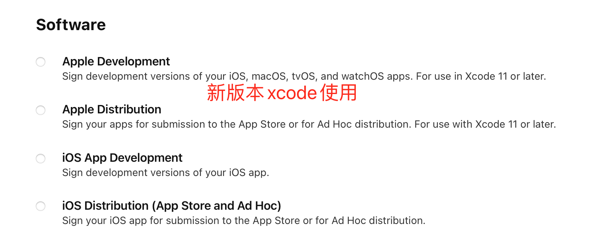
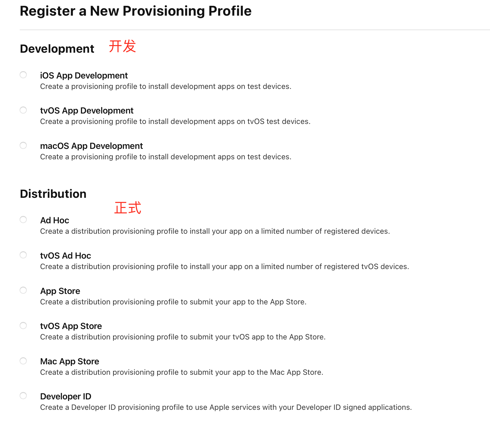
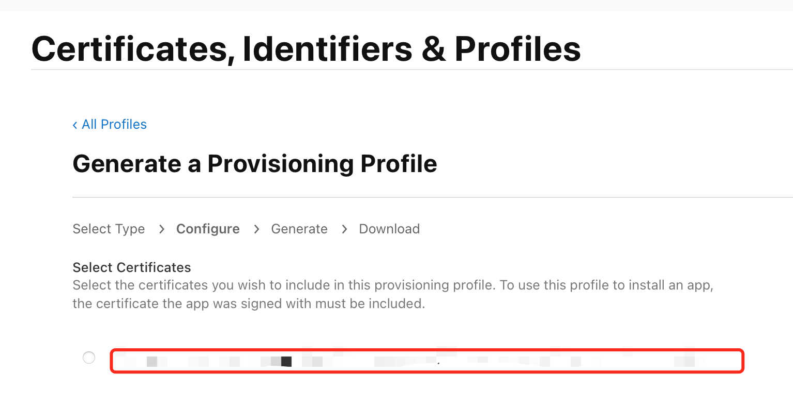
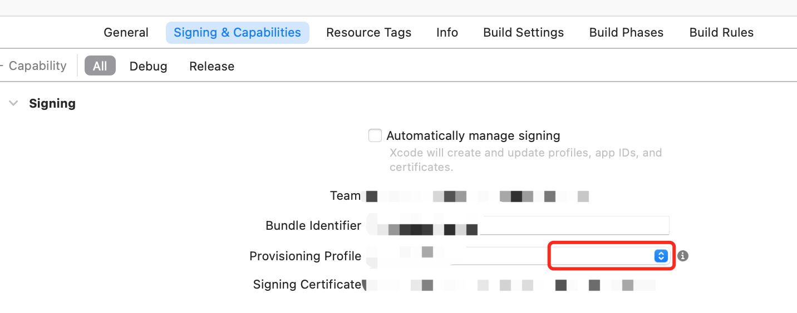

苹果开发者账号在使用过程中遇到的一些问题，进行了整理汇总。

<!--more-->

------

## 1. 证书相关问题

### 1.1 证书（Certificates）

苹果开发者账号中的证书分为两大类：`Software`、`Services`。

#### 1.1.1 APNs推送证书

`APNs`推送证书用于消息推送，属于`Service`证书，创建如下：

`CSR（Certificate Signing Request）`文件创建：

1. 打开`Mac`的`钥匙串访问`应用

2. 申请`CSR`文件

   

3. 输入邮箱，选择`存储到磁盘`，即可生成`CSR`文件

下载导入`APNs`证书

1. 在导入`APNs`证书前，根据官网操作提示，需要先下载安装以下四个证书，这样安装的其他证书才能被正确识别，否则安装的证书，会被提示“开发证书不受信任”

   

2. 证书先下载，然后双击`xx.cer`文件，证书会自动完成安装，可以通过`钥匙串访问`应用进行查看和导出

3. 导出`p12`格式证书，然后上传到极光或其他推送平台即可

#### 1.1.2 应用证书

应用证书用于签名打包，属于`Software`证书，创建如下：

同样需要使用`CSR`文件，完成创建，并同上进行下载、安装即可

#### 1.1.3 证书过期

证书过期之后，或者即将过期，可以点击`Revoke`进行撤销，然后创建新的证书即可。

### 1.2 描述文件（Profiles）

`iOS Provisioning Profiles`（描述文件）它用来标识某个设备是否具有安装某个应用的权限。

描述文件分为开发描述文件和发布描述文件。其中发布描述文件又分为临时发布描述文件和正式发布描述文件。

1. 开发描述文件(develop provisioning profile)开发描述文件，创建它需要bundle ID + 开发证书 ＋ 测试设备(在devices中添加); 编译的时候必须三者对应，否则编译器会报错。
2. 临时发布描述文件(distribution ad hoc)临时发布描述文件是用来在有限设备上发布的。创建它需要bundle ID ＋发布证书＋发布设备，编译时也必须三者对应。
3. 正式发布描述文件(distribution appstore/distribution ad house)个人账号和企业账号创建的正式发布描述文件是不同的。因为个人账号是在appstrore上发布，所以创建的是distribution appstore描述文件，而企业账号只能内部发布，所以创建的叫distribution ad house描述文件。但是它们创建所需要的东西都是一样的：bundle ID + 发布证书。因为他们是在不确定的设备上安装的，所以不需要选择设备。

如果描述文件不存在，或者已经过期，则需要创建新的描述文件。

根据使用场景，创建不同的描述文件：

选择证书，此时只能选择`Software`证书，因此必须先创建好`Software`证书后，再创建对应的描述文件。

创建完成之后，可以下载，双击导入到`xcode`中使用。`xcode`需要先登录开发者账号，然后也可以直接下载描述文件。

可以勾选`Automatically manage signing`，自动读取描述文件。但是我的自动读取存在些问题，我就选择了关闭自动读取，手动选择描述文件。点击上图红框，可以选择 `Download` 自动下载描述文件。

`xcode11`以上，使用`iOS Distribution`证书，会出现无法读取描述文件中的证书的问题，使用`Apple Distribution`证书即可。

